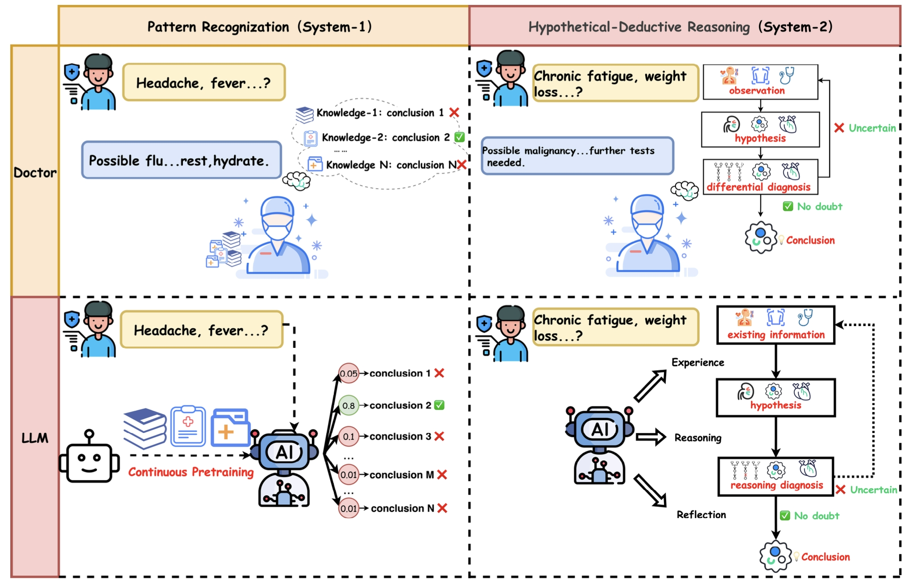
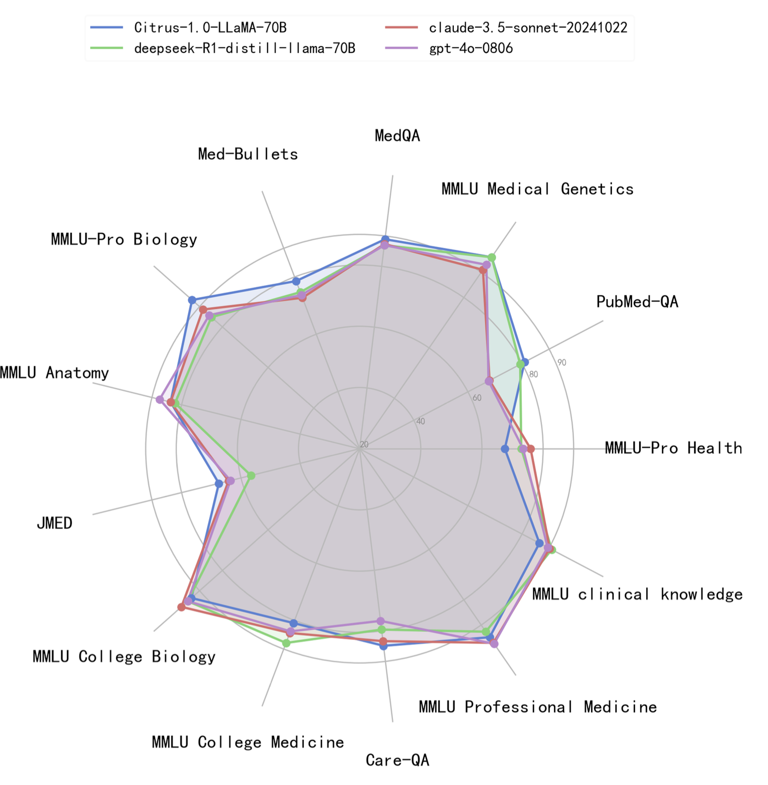

# Citrus: Leveraging Expert Cognitive Pathways in a Medical Language Model for Advanced Medical Decision Support

<p align="center">
<a href="https://arxiv.org/abs/2502.18274" target="_blank">📑Paper</a> ｜<a href="https://jdh-algo.github.io/Citrus/" target="_blank">🔗Github Page</a> | <a href="https://huggingface.co/jdh-algo/Citrus1.0-llama-70B" target="_blank">🤗models</a> | <a href="https://huggingface.co/datasets/jdh-algo/Citrus_S3" target="_blank">📚Medical Reasoning Data</a> ｜ <a href="https://huggingface.co/datasets/jdh-algo/JMED" target="_blank">📚Evaluation Data</a>
</p>


## Introduction
<div align="center">

</div>

Citrus is a medical language model that bridges the gap between clinical expertise and AI reasoning by emulating the cognitive processes of medical experts. The model is trained on a large corpus of simulated expert disease reasoning data, synthesized using a novel approach that accurately captures the decision-making pathways of clinicians. 

The contributions of this work are as follows:

1. We propose a training-free reasoning approach that emulates the cognitive processes of medical experts, enabling large language models to enhance their medical capabilities in clinical diagnosis and treatment.

2. In conjunction with the data construction method, we introduce a multi-stage post-training approach to further improve the model’s medical performance.

3. We have made the Citrus model and its training data publicly available as open-source resources to advance research in AI-driven medical decision-making.

4. We have developed and open-sourced a large-scale, updatable clinical practice evaluation dataset based on real-world data, accurately reflecting the distribution of patients in real-world settings.

In this repository, we introduce more details about Citrus, which includes model, data, and code.

## Performance

Citrus1.0-Llama-70B reach a top class performance on 70B scale models, especially on MedQA, PubMedQA, MedBullets, CareQA benchmark. Citrus also surpasses many close-source top LLMs such as Claude-sonnet and GPT-4o. Our model consistently demonstrates strong performance across a wide range of medical benchmarks, highlighting the effectiveness of our proposed approach.
<div align="center">

</div>

## Model Access

|                        | Backbone       | Supported Languages | Link                                                                  |
| -----------------------| ------------   | ----- | --------------------------------------------------------------------- |
| **Citrus1.0-Llama-70B**   | LLaMA-3.1-70B  | English    | [HF Link](https://huggingface.co/jdh-algo/Citrus1.0-llama-70B)|
| **Citrus1.0-Qwen-72B** | Qwen2.5-72B    | English & Chinese | [HF Link](https://huggingface.co/jdh-algo/Citrus1.0-Qwen-72B)|

## Data Access

| Data                  | Usage | Description | Link |
| -----------------------| --- |--------------| --- |
| Citrus_S3 | train data | A portion of the training data for the model includes 20k data points. | [Link](https://huggingface.co/datasets/jdh-algo/Citrus_S3)|
| JMED        | test data | The dataset originates from anonymized doctor-patient dialogues at JD Health Internet Hospital, filtered to retain consultations adhering to standardized diagnostic workflows. The initial release contains 1,000 high-quality clinical records spanning all age groups (0-90 years) and multiple specialties. | [Link](https://huggingface.co/datasets/jdh-algo/JMED/tree/main)|

## Code

### Install
```bash
# code download
git clone git@github.com:jdh-algo/Citrus.git

cd Citrus

# install dependency
1、python env
    1.1 Anaconda is recommended to manage the virtual environment, (link: https://www.anaconda.com/download)
    1.2 conda create -n [env_name] python=3.10
    1.3 conda activate [env_name]
2、install poetry:
    pip install poetry

3、install dependency with poetry:
    poetry install

```
### Model Use
**Start:** To start our model, you can use code from the backbone model( [Qwen](https://github.com/QwenLM/Qwen2.5), [Llama](https://github.com/meta-llama/llama3) ), or deploy with [vllm](https://github.com/vllm-project/vllm). 
```
# Run the following code to start vllm
nohup python -m vllm.entrypoints.api_server --model {your checkpoint} --tensor-parallel-size 8 --port 8080 --disable-custom-all-reduce > {your log file} 2>&1 &
```

**Prompt:** Use the following prompt to make the model thinking as medical expert
```prompt
# system prefix
You are an expert with extensive experience in medical research and clinical practice, and you are needed to assist users in answering questions related to medical issues. Let's think step by step.

# user prompt
You are tasked with addressing a medical examination question. Please carefully read the question, provide a detailed thought process, and then present your final answer.
Here is the question:
<Question>
{question}
</Question>

Please begin your response.

The formatted output should be as follows:
<think>
[Insert Your Detailed Thought Process here]
</think>
<answer>
[Insert Your Final Answer here]
</answer>

```


### Config
```yaml
# Config file for LLMs api: src/config/config/model_api.yml
open_ai:
  - url: ""
  - app_key: ""

local_vllm:
  - url: "127.0.0.1:8080"
```
```yaml
# Config file for data: src/config/config/data.yml
datasets:
 - name: "medqa"
   download_file: "medqa/phrases_no_exclude_test.jsonl"
 - name: "pubmedqa"
   download_file: "pubmedqa/ori_pqal.json"
 - name: "mmlu-anatomy"
   download_file: "mmlu/anatomy_test.csv"
...
```


### Run
```bash
# task_card files are used for pass parameter
# here are some examples

# data preprocess
cd src & python main.py --app data_preprocess --task_card config/task_card/create_origin_file.json

# data label
cd src & python main.py --app data_preprocess --task_card config/task_card/data_label.json

# sft data synthesis (Citrus_S3)
cd src & python main.py --app data_synthesis --task_card config/task_card/sft_data_synthesis.json

# xpo sample
cd src & python main.py --app data_synthesis --task_card config/task_card/xpo_sample.json

# model evaluation
cd src & python main.py --app evaluation --task_card config/task_card/model_evaluation.json

# model train sft
# Notice: model_train is a standalone project that requires installing the requirements separately.
cd model_train & sh run_sft.sh

# model train xpo
# Notice: model_train is a standalone project that requires installing the requirements separately.
cd model_train & sh run_cpo.sh
```

